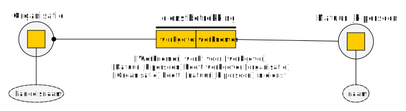
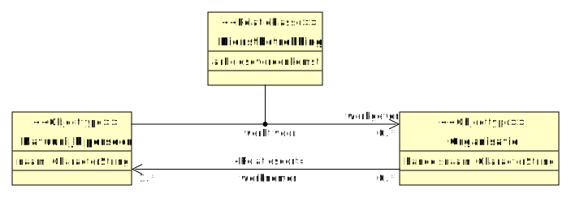
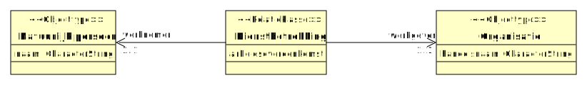
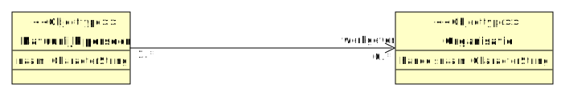
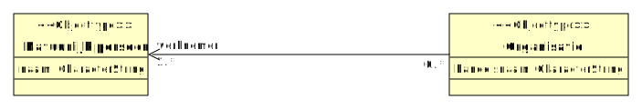
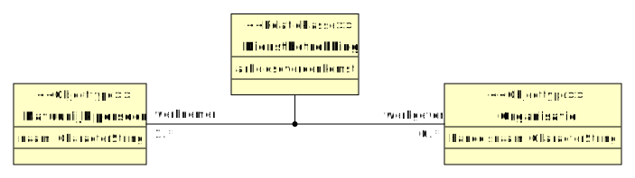

# Relaties

## Introductie

Objecten uit het domein dat we wensen te beschouwen, kunnen een relatie hebben met andere objecten. Dergelijke relaties wensen we te typeren. Deze typering is zowel op het conceptuele niveau van belang als op het logische gegevensniveau. Deze typering zal echter wel verschillen, zoals in deze verkenning tot uitdrukking wordt gebracht.

> Met **typeren** wordt in dit document bedoelt: het beschrijven van de kenmerken waar "iets" aan moet voldoen om tot dat betreffende type te behoren. Typeren gaat met andere woorden om beschrijven van generieke kenmerken. Welke kenmerken van belang zijn, hangt af van wat je wilt beschouwen. Op conceptueel niveau beschouwen we de werkelijkheid, en daarmee bestaat de typering ook uit het beschrijven van de objecten die we willen onderscheiden, hun eigenschappen en onderlinge relaties. Op logisch niveau beschouwen we de gegevens, en daarmee bestaat de typering ook uit het beschrijven van de gegevens die we wensen te verwerken: waarover ze gaan en welke vorm ze hebben.

## Voorbeelduitwerking

Als voorbeeld nemen we de arbeidsrelatie: de dienstbetrekking tussen een werkgever en een werknemer. Hiervoor is een begrippenkader uitgewerkt conform Artikel 610 van het Burgerlijk wetboek, Boek 7. Zie: [Begrippenkader Dienstbetrekking](https://geonovum.github.io/mim-metamodel/modellen/dienstbetrekking).

## Typering van een relatie op conceptueel niveau

### Wat we willen vastleggen

Bij de typering van de dienstbetrekking op conceptueel niveau willen we de volgende zaken kunnen beschrijven. (NB: niet alles wil je voor elke relatie(type) beschrijven, maar elk onderdeel komt een keer voor):

1. Welke typen objecten (Objecttypen) een rol spelen in de relatie;
2. Welke kardinaliteit daarbij geldt;
3. Hoe deze rollen worden benoemd (de naam van de rol);
4. Wat de naam is van de relatie;
5. Hoe de relatie wordt verwoord, dwz: hoe je hem zou uitdrukken in een zinnetje.

Voor een dienstbetrekking gaat het daarmee om de volgende zaken:

1. In een dienstbetrekking spelen de objecttypen «Natuurlijk persoon» en «Organisatie» een rol;
2. Daarbij geldt dat een organisatie één of meerdere natuurlijke personen in dienst heeft, en een natuurlijk persoon bij meerdere organisatie kan werken;
3. Een «Natuurlijk persoon» vervult de rol van «Werknemer» in deze relatie, een «Organisatie» vervult de rol van «Werkgever»;
4. De relatie heeft de naam "dienstbetrekking";
5. De relatie kan op de volgende wijzen worden verwoord:
   - «Werknemer» *werkt voor* «Werkgever»;
   - «Natuurlijk persoon» *heeft werkgever* «Organisatie»;
   - «Organisatie» *heeft* «Natuurlijk persoon» *in dienst*.

### CIM uitgedrukt in FBM

Bovenstaande typering kun je uitdrukken in FBM met onderstaand figuur.

### CIM uitgedrukt in MIM

De typering van de dienstbetrekking is in MIM (nu) niet helemaal goed uit te drukken. Het meest in de buurt komt onderstaand figuur.

Merk op: in onderstaand figuur is een eigenschap «arbeidsovereenkomst» opgenomen bij de relatieklasse. Dit is gedaan om te laten zien waarom een relatieklasse in dit geval nodig zou (kunnen) zijn. In het FBM model is deze eigenschap voor de eenvoudig niet opgenomen. Ook zou je kunnen stellen dat «arbeidsovereenkomst» geen eigenschap is, maar een relatie naar een «Document» waarin de arbeidsovereenkomst is opgenomen. Dergelijke details zijn buiten scope van deze casus.

Daarbij valt het volgende op:

1. De naam van de relatieklasse en de verwoording op de lijn ("werkt voor") moet conform het metamodel van MIM 1.2 nu gelijk zijn. Hoewel het in UML technisch mogelijk is om bv de naam van de relatieklasse "Dienstbetrekking" te maken, is dit niet conform het metamodel en ook niet (helemaal) in lijn met de bedoeling van een relatieklasse. De verwoording is namelijk in het metamodel gelijk aan de naam van de relatie(klasse), en er mag maar 1 naam zijn;
2. Hoewel sprake is van 1 type relatie, moet dit in MIM als twee losse relatiesoorten beschreven worden (waarbij ook maar aan 1 van de relaties de relatieklasse kan worden gehangen);
3. Er is slechts ruimte voor één voorwoording OF naam. In dit geval is de naam en één van de twee verwoordingen weggevallen.

### CIM uitgedrukt in MIM waarbij de relatie al verzelfstandigd is

Een alternatieve manier om de dienstbetrekking-relatie te modelleren, is om direct uit te gaan van een geobjectiveerde relatie. Dit is afgebeeld in onderstaand figuur.

Daarbij valt het volgende op:

1. De relatie is (op dit moment) niet te onderscheiden van een normaal objecttype. De "lijnen" van de relatie naar Persoon en Organisatie zijn nu zelf relaties geworden, terwijl dit niet de bedoeling is: er is maar 1 relatie (!).
2. De verwoording van de relatie heeft geen plek meer in het model. Je zou deze kunnen "verspreiden" over de twee lijnen tussen respectievelijk Persoon en de relatie en de relatie en Organisatie, maar dat is gekunsteld en niet in lijn met het metamodel.

Deze variant is hieronder niet verder uitgewerkt.

## Typering van een relatie op logisch niveau

Op logisch niveau beschrijven we gegeven, in geval van een relatie gaat het (dus) om een uitspraak over de relatie tussen twee objecten. Voor zo'n uitspraak is het van belang wat we uitspreken. Daarvoor hebben we een aantal mogelijkheden:

1. We wensen gegevens vast te leggen *bij* een natuurlijk persoon *over* de relatie;
2. We wensen gegevens vast te leggen *bij* een organisatie *over* de relatie;
3. We wensen gegevens vast te leggen *over* de relatie *bij* de relatie zelf.

De keuze bepaald hoe het gegevensmodel er uit ziet, en wat je nodig hebt van het conceptuele model. Vervolgens kan hiervan een model worden gemaakt.

### LGM situatie 1 uitgedrukt in MIM

In deze situatie willen we expliciet maken dat de relatie wordt bijgehouden in het gegevensobjecttype van de natuurlijk persoon. We hebben daarbij twee mogelijkheden. We kunnen het gegevenstype "werkt voor" noemen, of "werkgever". We kiezen voor het laatste.

### LGM situatie 2 uitgedrukt in MIM

In deze situatie willen we expliciet maken dat de relatie wordt bijgehouden in het gegevensobjecttype van de organisatie. We kiezen om dit gegevenstype de naam "werknemer" te geven.

### LGM situatie 3 uitgedrukt in MIM

In deze situatie willen we expliciet maken dat we gegevens van de relatie zelf bijhouden, los van de gegevens van een natuurlijk persoon of organisatie. Vanzelfsprekend kan deze relatie alleen bestaan indien beide objecten bestaan (!). Voor de naam van het gegevensobjecttype gebruiken we de naam van de relatie ("Dienstbetrekking"), voor de gegevenstypen gebruiken we de namen "werkgever" en "werknemer".

Twee visualisaties zijn denkbaar, beiden visualiseren exact hetzelfde.

## Voorstel voor verbetering

Onderstaand enkele mogelijke voorstellen om relaties beter te kunnen typeren, waarbij rekening wordt gehouden met de huidige praktijk in MIM 1.2

### Op conceptueel niveau

1. Maak expliciet of het label op de lijn van de relatie de *naam* van de relatie voorstelt of de *verwoording*. (alternatief: label op de lijn van de relatie is altijd de voorkeurs *verwoording*);
2. Neem in het metamodel expliciet de mogelijkheid op om één of meerdere verwoordingen op te nemen, inclusief leesrichting;
3. Gebruik op conceptueel niveau het driehoekje bij voorkeur om de leesrichting aan te geven;
4. Gebruik op conceptueel niveau de "pijl" om aan te geven of de relatie primair gezien moet worden vanuit de bron van de pijl. In dat geval volgt de leesrichting de pijl.;
5. Indien gebruik wordt gemaakt van een relatieklasse, dan betreft de label op de lijn van de relatie altijd een *verwoording*
6. Rolnamen staan *nooit* als label op de relatielijn (maar aan de rand). Wel kan het zo zijn dat de rolnaam en de verwoording (bijna) overeen komen. (de verwoording is dan bv "heeft werkgever").

### Op logisch niveau

1. Een relatie-lijn stelt een gegevenstype voor. Deze heeft (dus) ook altijd een richting en precies 1 naam. Alleen relatieroldoel bestaat. Het is optioneel toegestaan om een verwoording op te lijn te (laten) staan, dit betreft dan de verwoording van het gegevenstype.
2. Indien de relatieklasse afzonderlijk wordt bijgehouden, ontstaan twee lijnen, voor elk gegevenstype één (zoals in situatie 3).
